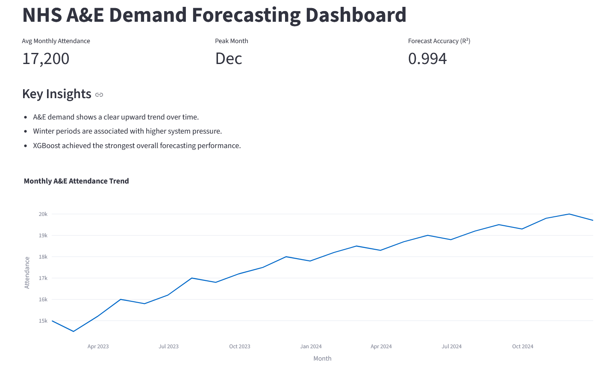
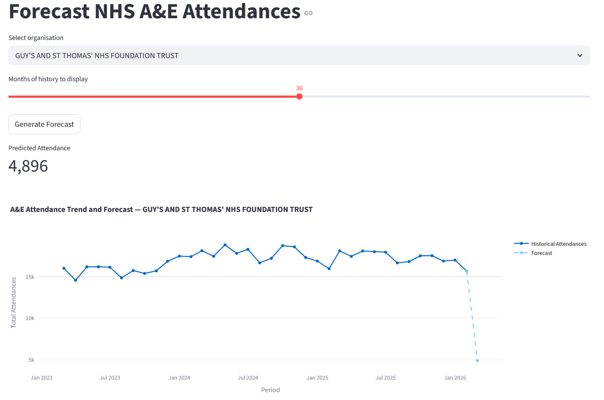
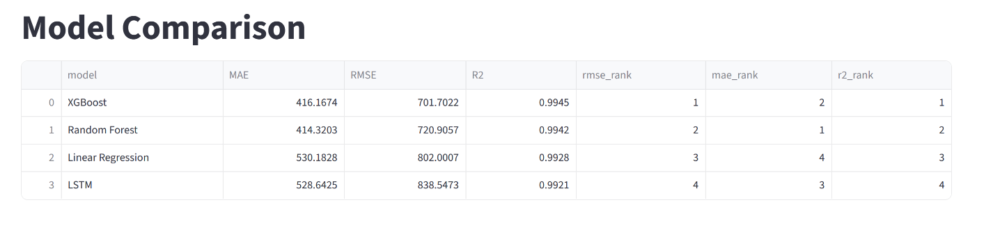

## NHS A&E Forecasting System
End-to-end data science project forecasting NHS Accident & Emergency (A&E) demand using SQL, machine learning, and deep learning, deployed with FastAPI and Streamlit.

**Achieves highly accurate demand prediction (R² up to 0.9945) to support NHS capacity planning and reduce patient wait times.**

Built as part of my transition from IT Support to Data Science & AI

## Problem

NHS Accident & Emergency (A&E) departments face highly variable and unpredictable demand, leading to long waiting times, 4-hour target breaches, and resource strain.

This contributes to increased patient risk, overcrowding, and pressure on clinical staff.

Accurate forecasting of patient demand is essential for:
- workforce planning
- capacity management
- reducing delays in care

This project builds a forecasting system to predict A&E attendances and support operational decision-making.

## Real-World Impact
Accurate A&E demand forecasting helps NHS organisations:

- Plan staffing levels more effectively
- Anticipate seasonal pressure (especially winter surges)
- Reduce patient waiting times and overcrowding
- Allocate resources across trusts more efficiently

This project demonstrates how data science can directly support NHS operational decision-making.

## Live Demo
- **Interactive Dashboard:** [View Dashboard](https://nhs-ae-forecast.streamlit.app/)
- **API Documentation:** [View Here](https://nhs-ae-sql-analysis.onrender.com/docs)
- **API Health Check**: [View Here](https://nhs-ae-sql-analysis.onrender.com/health)

## Dashboard Preview
Below are key views from the interactive NHS A&E demand forecasting dashboard.

### Dashboard Overview
[](images/dashboard_main.png)

### Forecast View
[](images/dashboard_forecast.png)

### Model Comparison
[](images/model_comparison.png)

## Project Architecture
The system follows a modular data pipeline from raw NHS data to deployed forecasting application:
```
Raw NHS Data (2020-2026)
→ Data Cleaning & Standardisation
→ SQLite Database
→ SQL Analysis
→ Feature Engineering
→ Forecasting Models (XGBoost, LSTM)
→ FastAPI Backend
→ Streamlit Dashboard
```

## Deployment & Application
This project is deployed as a full data product:

**FastAPI Backend**
- Serves trained model predictions
- Provides REST API endpoints for forecasting

**Streamlit Dashboard**
- Interactive visualisation of demand trends
- Forecast exploration
- Model comparison

This demonstrates end-to-end delivery from data to user-facing application.

This transforms the project from a static analysis into a production-ready data application.

## Key Insights
- A small number of trusts handle ~65% of total demand
- Higher demand strongly correlates with 4-hour breaches
- Significant variation exists in long (12+ hour) waits
- Clear seasonality: winter months consistently show higher pressure
- Demand is strongly influenced by recent historical patterns

These insights highlight the operational pressure points within NHS A&E services and reinforce the need for predictive planning.

## Business Impact

These insights and forecasts can support:

- Proactive staffing decisions during peak demand
- Identification of high-pressure NHS trusts
- Reduction of 4-hour and 12-hour wait breaches
- Data-driven planning for winter pressure periods

This transforms raw NHS data into actionable insights that support real-world operational decision-making.

## Approach
- Combined multi-year NHS datasets (2020–2026)
- Cleaned and standardised data across years
- Engineered operational and time-series features
- Built SQL queries for demand and performance analysis
- Developed forecasting models using multiple approaches
- Deployed predictions via API and dashboard
- Evaluated models using time-based splits to reflect real-world forecasting scenarios

## Validation Approach

Time-based train-test splitting was used to reflect real-world forecasting conditions, ensuring that models were evaluated on future unseen data rather than random splits.

This approach prevents data leakage and better represents production forecasting scenarios.

## SQL Analysis
This folder contains SQL queries used for the NHS A&E analysis project.
- `01_national_summary.sql` — national totals and validation
- `02_top_attendance_orgs.sql` — busiest organisations
- `03_over4_waits.sql` — 4-hour breach analysis
- `04_long_waits.sql` — 12+ hour delays
- `05_regional_summary.sql` — regional comparison
- `06_rankings.sql` — pressure ranking across organisations

## Model Comparison

Multiple models were evaluated to determine the most effective forecasting approach:

- Linear Regression → baseline model
- Random Forest → strong non-linear performance
- XGBoost → best overall performance
- LSTM → tested for deep learning sequence modelling

Tree-based models outperformed deep learning due to the structured nature of the dataset.

This demonstrates that model selection should be driven by data characteristics rather than model complexity.

## Model Performance
**Best Performing Model: XGBoost**

| Model | MAE | RMSE | R² |
|------|-----:|------:|----:|
| XGBoost | 416.17 | 701.70 | 0.9945 |
| Random Forest | 414.32 | 720.91 | 0.9942 |
| Linear Regression | 530.18 | 802.00 | 0.9928 |
| LSTM | 528.64 | 838.55 | 0.9921 |

## Model Selection
For deployment, **XGBoost** was selected as the production model because it delivered the best overall balance of forecast quality based on **RMSE** and **R²**, while Random Forest achieved a slightly lower MAE.

## Why XGBoost performed better:
- Handles structured/tabular data more effectively
- Captures non-linear relationships with engineered features
- More stable with limited dataset size
- Easier to tune and deploy

## Why LSTM underperformed:
- The dataset is structured rather than raw sequential signals
- Limited observations per organisation
- Requires more complex tuning and scaling

For this problem, **feature engineering + tree-based models outperform deep learning.**

This highlights the importance of **choosing models based on characteristics, not complexity.**

## Forecasting Approach
### Objective
Predict monthly A&E attendances per NHS organisation

### Features Used
- Lag features (1, 3, 6, 12 months)
- Rolling averages and variability
- Seasonal encoding (month cyclic features)
- Operational indicators (admissions, wait times, booked attendances)

## Deployment Configuration
The live API and dashboard are configured to use:

- **Model Type:** XGBoost
- **Model File:** `models/xgboost_model.json`

This setup allows the model to be easily updated or replaced without changing the application layer.

## Key Takeaway
This project shows that:
- Real-world forecasting is driven more by **data quality and feature engineering** than model complexity
- Tree-based models can outperform deep learning on structured datasets
- End-to-end delivery (data → model → API → dashboard) is critical in production environments

## Tech Stack
- Python (Pandas, NumPy)
- SQL & SQLite
- Scikit-learn
- XGBoost
- TensorFlow (LSTM)
- Matplotlib & Seaborn
- FastAPI
- Streamlit

## Project Structure
- `data/raw/` → original NHS datasets (ignored in Git)
- `data/processed/` → cleaned datasets and outputs
- `models/` → saved model artifacts
- `notebooks/` → analysis and modelling
- `src/` → reusable functions
- `sql/` → SQL queries
- `api/` → FastAPI backend
- `app/` → Streamlit dashboard

## How to Run

You can explore the dashboard directly or run the project locally using the steps below.

### 1. Clone the repository
```bash
git clone https://github.com/dd4real2k/nhs-ae-forecast.git
cd nhs-ae-forecast
```
### 2. Install dependencies
```
pip install -r requirements.txt
```
### 3. Run API
```
uvicorn api.main:app --reload
```
### 4. Run dashboard
```
streamlit run app/Dashboard.py
```
## What This Project Demonstrates
- Working with real NHS datasets
- Writing analytical SQL queries
- Building time-series forecasting models
- Comparing ML vs deep learning approaches
- Designing feature engineering pipelines
- Deploying models via FastAPI
- Building interactive dashboards
- Structuring a production-style data project

## Limitations
- No external drivers (weather, flu trends, population)
- Forecast currently depends on historical operational features
- SQLite used for simplicity (not production scale)
- No automated retraining or monitoring yet

## Future Improvements
- Add external features (weather, population, public holidays)
- Implement walk-forward validation
- Add SHAP explainability
- Add model monitoring & retraining pipeline

## Data Source
NHS England A&E monthly statistics (April 2020 – February 2026)

Source: [NHS England A&E Attendances and Emergency Admissions](https://www.england.nhs.uk/statistics/statistical-work-areas/ae-waiting-times-and-activity/ae-attendances-and-emergency-admissions-2025-26/)

## Recruiter Takeaway

This project demonstrates:

- End-to-end data pipeline development
- Real-world NHS data analysis
- Advanced forecasting using ML and deep learning
- API and dashboard deployment
- Strong alignment with healthcare analytics use cases

## Summary
This project demonstrates the ability to take:
**raw healthcare data → insight → forecasting → deployment**
— reflecting how modern data teams build and deploy data-driven solutions in real-world environments.

## Key Value

This project demonstrates the ability to deliver an end-to-end healthcare analytics solution — from raw NHS data to deployed forecasting system — aligning with real-world NHS data and operational challenges.
